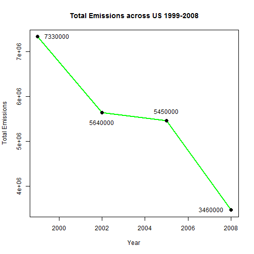
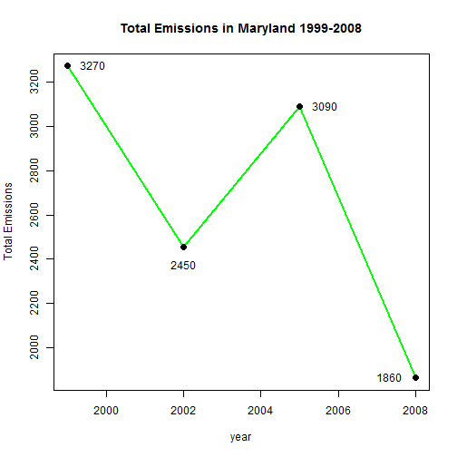
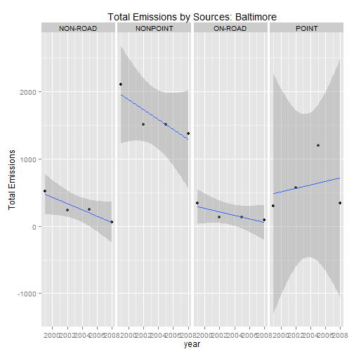
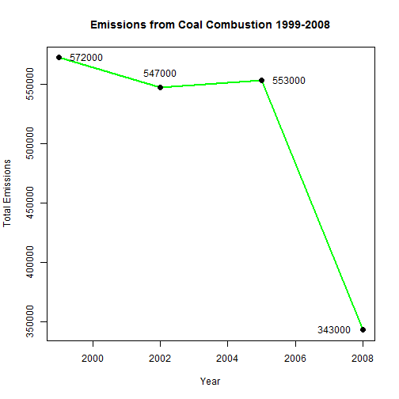
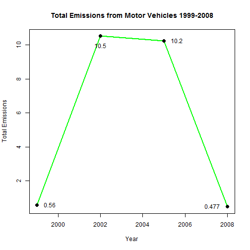
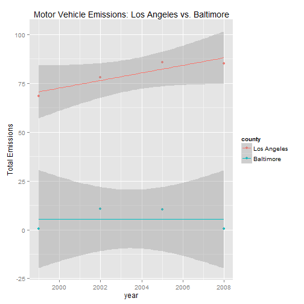

Explanatory Data Analysis - Peer Assessment 2
========================================================

## Reading data


```r
Code <- readRDS("~/Data for EDA PA2/Source_Classification_Code.rds")
```


There are 11717 rows in this sets. Here is a look at a few rows


```r
dim(Code)
```

```
## [1] 11717    15
```

```r
head(Code[, 1:4])
```

```
##        SCC Data.Category
## 1 10100101         Point
## 2 10100102         Point
## 3 10100201         Point
## 4 10100202         Point
## 5 10100203         Point
## 6 10100204         Point
##                                                                   Short.Name
## 1                   Ext Comb /Electric Gen /Anthracite Coal /Pulverized Coal
## 2 Ext Comb /Electric Gen /Anthracite Coal /Traveling Grate (Overfeed) Stoker
## 3       Ext Comb /Electric Gen /Bituminous Coal /Pulverized Coal: Wet Bottom
## 4       Ext Comb /Electric Gen /Bituminous Coal /Pulverized Coal: Dry Bottom
## 5                   Ext Comb /Electric Gen /Bituminous Coal /Cyclone Furnace
## 6                   Ext Comb /Electric Gen /Bituminous Coal /Spreader Stoker
##                                EI.Sector
## 1 Fuel Comb - Electric Generation - Coal
## 2 Fuel Comb - Electric Generation - Coal
## 3 Fuel Comb - Electric Generation - Coal
## 4 Fuel Comb - Electric Generation - Coal
## 5 Fuel Comb - Electric Generation - Coal
## 6 Fuel Comb - Electric Generation - Coal
```


```r
eData <- readRDS("~/Data for EDA PA2/summarySCC_PM25.rds")
dim(eData)
```

```
## [1] 6497651       6
```

```r
head(eData)
```

```
##     fips      SCC Pollutant Emissions  type year
## 4  09001 10100401  PM25-PRI    15.714 POINT 1999
## 8  09001 10100404  PM25-PRI   234.178 POINT 1999
## 12 09001 10100501  PM25-PRI     0.128 POINT 1999
## 16 09001 10200401  PM25-PRI     2.036 POINT 1999
## 20 09001 10200504  PM25-PRI     0.388 POINT 1999
## 24 09001 10200602  PM25-PRI     1.490 POINT 1999
```


## Results
### Have total emissions reduced?


```r
library(reshape2)
dataMelt <- melt(eData, id = "year", measure.vars = "Emissions")
datacast <- dcast(dataMelt, year ~ variable, sum)

plot(datacast$year, datacast$Emissions, type = "l", col = "green", lwd = 2, 
    main = "Total Emissions across US 1999-2008", xlab = "Year", ylab = "Total Emissions")
points(datacast$year, datacast$Emissions, pch = 20, cex = 2)
text(datacast$year, datacast$Emissions, pos = c(4, 1, 3, 2), labels = signif(datacast$Emissions, 
    3), offset = 1)
```

 


### Have total emissions reduced in Baltimore/Marryland fips = 24510


```r
maryland_data <- subset(eData, eData$fips == "24510")
maryland_Melt <- melt(maryland_data, id = c("year", "type"), measure.vars = "Emissions")
maryland_cast <- dcast(maryland_Melt, year ~ variable, sum)

plot(maryland_cast$year, maryland_cast$Emissions, type = "l", col = "green", 
    lwd = 2, main = "Total Emissions in Maryland 1999-2008", xlab = "year", 
    ylab = "Total Emissions")
points(maryland_cast$year, maryland_cast$Emissions, pch = 20, cex = 2)
text(maryland_cast$year, maryland_cast$Emissions, pos = c(4, 1, 4, 2), labels = signif(maryland_cast$Emissions, 
    3), offset = 1)
```

 


### Comparing among 4 types of sources


```r
library(ggplot2)
baltimore_cast <- dcast(maryland_Melt, type + year ~ variable, sum)

qplot(year, Emissions, data = baltimore_cast, facets = . ~ type, main = "Total Emissions by Sources: Baltimore", 
    ylab = "Total Emissions", geom = c("point", "smooth"), method = "lm")
```

 


### comparing emissions from coal combustion related sources

Finding the sector (EI.Sector that has activity of Combustion and Coal related by using grep function to find any value that contains "Comb" and "Coal"


```r
comb_coal <- grep("Comb .* Coal", Code$EI.Sector, value = TRUE)

# and subset the data that contains only Comb Coal value

comb_coalData <- subset(Code, Code$EI.Sector %in% comb_coal)

# now we subset the data from the original dataset that contains the SCC
# that's matched the SCC in the comb_coalData

comb_coalEmission <- subset(eData, eData$SCC %in% comb_coalData$SCC)

head(comb_coalEmission)
```

```
##        fips        SCC Pollutant Emissions     type year
## 9979  09011   10100217  PM25-PRI   479.907    POINT 1999
## 15882 23001 2102001000  PM25-PRI     0.054 NONPOINT 1999
## 15892 23001 2103002000  PM25-PRI     0.231 NONPOINT 1999
## 17790 23003 2102001000  PM25-PRI     0.032 NONPOINT 1999
## 17800 23003 2103002000  PM25-PRI     0.194 NONPOINT 1999
## 19504 23005   10200202  PM25-PRI     0.119    POINT 1999
```


Reshape the data and make a plot


```r
comb_coalMelt <- melt(comb_coalEmission, id = c("type", "year"), measure.vars = "Emissions")
comb_coalSum <- dcast(comb_coalMelt, year ~ variable, sum)

plot(comb_coalSum$year, comb_coalSum$Emissions, type = "l", lwd = 2, col = "green", 
    main = "Emissions from Coal Combustion 1999-2008", xlab = "Year", ylab = "Total Emissions")

points(comb_coalSum$year, comb_coalSum$Emissions, pch = 20, cex = 2)
text(comb_coalSum$year, comb_coalSum$Emissions, pos = c(4, 3, 4, 2), labels = signif(comb_coalSum$Emissions, 
    3), offset = 1)
```

 


### Emission from motor vehicle sources


```r
motor <- grep("[Mm]otor", Code$Short.Name, value = TRUE)

motorSCC <- subset(Code, Code$Short.Name %in% motor)

motorData <- subset(eData, eData$SCC %in% motorSCC$SCC & eData$fips == "24510")

head(motorData)
```

```
##         fips        SCC Pollutant Emissions    type year
## 114686 24510 220108023B  PM25-PRI      0.05 ON-ROAD 1999
## 114688 24510 220108023T  PM25-PRI      0.01 ON-ROAD 1999
## 114693 24510 220108023X  PM25-PRI      0.13 ON-ROAD 1999
## 114695 24510 220108025B  PM25-PRI      0.02 ON-ROAD 1999
## 114701 24510 220108025X  PM25-PRI      0.06 ON-ROAD 1999
## 114703 24510 220108027B  PM25-PRI      0.03 ON-ROAD 1999
```


Reshape and plot


```r
motorMelt <- melt(motorData, id = c("type", "year"), measure.vars = "Emissions")
motorSum <- dcast(motorMelt, year ~ variable, sum)

plot(motorSum$year, motorSum$Emissions, type = "l", lwd = 2, col = "green", 
    main = "Total Emissions from Motor Vehicles 1999-2008", xlab = "Year", ylab = "Total Emissions")

points(motorSum$year, motorSum$Emissions, pch = 20, cex = 2)
text(motorSum$year, motorSum$Emissions, pos = c(4, 1, 4, 2), labels = signif(motorSum$Emissions, 
    3), offset = 1)
```

 


### Comparing motor vehicle emissions between baltimore and new york


```r
county <- c("24510", "06037")
motorData1 <- subset(eData, eData$SCC %in% motorSCC$SCC & eData$fips %in% county)

Melt <- melt(motorData1, id = c("fips", "year"), measure.vars = "Emissions")
Sum <- dcast(Melt, fips + year ~ variable, sum)

Sum$fips <- factor(Sum$fips)
levels(Sum$fips) <- c("Los Angeles", "Baltimore")
names(Sum) <- c("county", "year", "Emissions")

qplot(year, Emissions, data = Sum, color = county, main = "Motor Vehicle Emissions: Los Angeles vs. Baltimore", 
    ylab = "Total Emissions", geom = c("point", "smooth"), method = "lm")
```

 

